

  <a href="../../releases">
    <picture>
      <source media="(prefers-color-scheme: dark)" srcset="docs/brand/artcraft-logo-white.svg">
      
    </picture>
  </a>

<h1 align="center">VectorCraft</h1>

  <b>Vector illustration; an open-source, clean-room reimplementation of Adobe Illustrator, rebuilt in pure Rust.</b>

  A fast, open-source, clean-room take on the Adobe Illustrator workflow. It runs natively on
  macOS, Windows, Linux and FreeBSD, and in the browser via WebAssembly. Built by the ArtCraft team.

  
  
  
  
  

 

  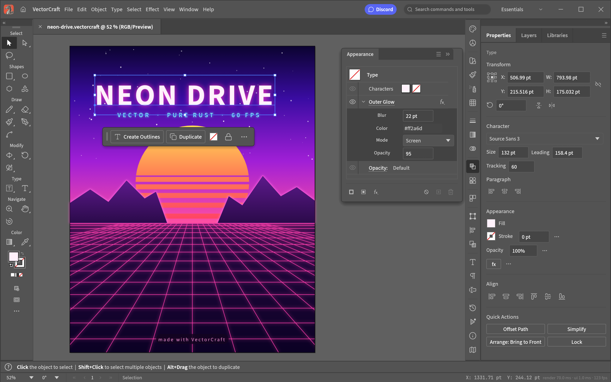
   <b>Neon Drive</b>: a Pathfinder-cut sun, live Outer Glow on the type and grid, and clipping masks · <code>examples/neon-drive.vectorcraft</code>

## A look around

<table>
<tr>
<td width="50%" valign="top">
  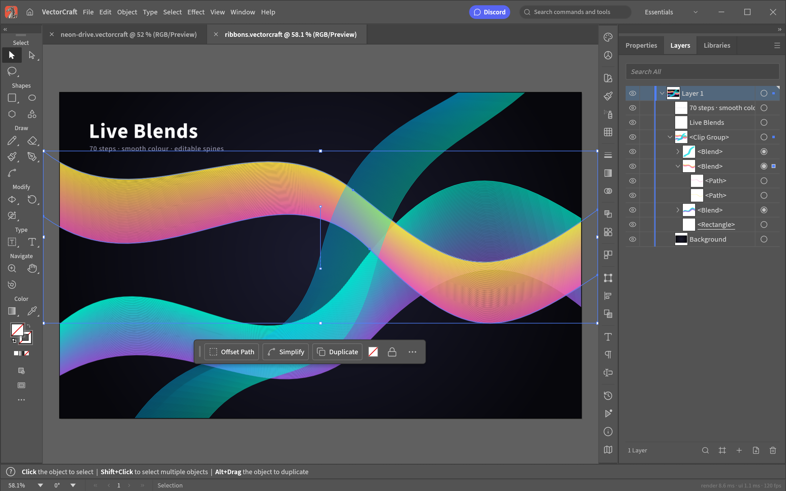
  
<b>Live Blends and Layers</b>: editable key paths, smooth colour, every object a row

</td>
<td width="50%" valign="top">
  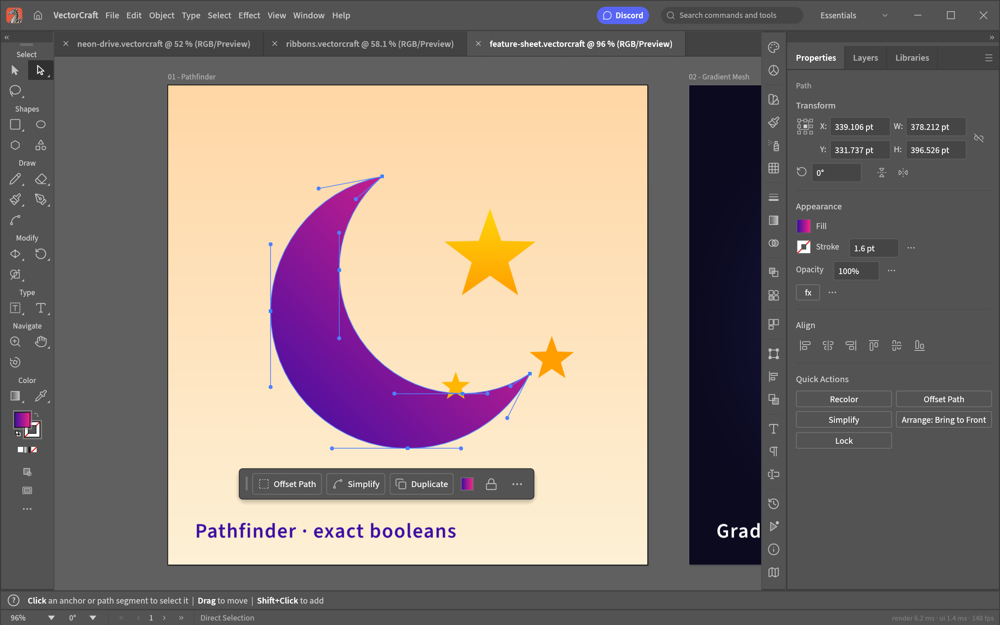
  
<b>Pen and Direct Selection</b>: real Bézier anchors and handles, plus a contextual task bar

</td>
</tr>
<tr>
<td width="50%" valign="top">
  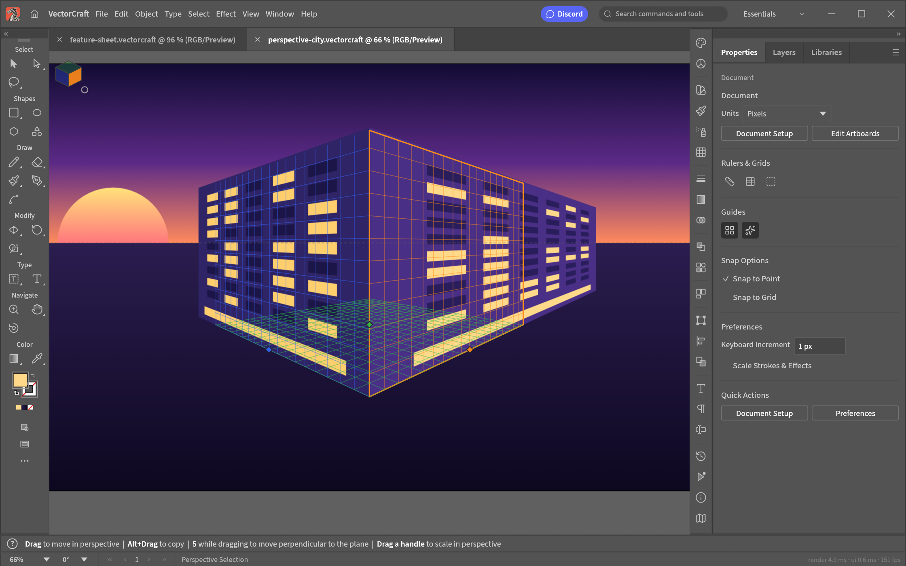
  
<b>Perspective Grid</b>: art attached to its planes stays editable in perspective · <code>examples/perspective-city.vectorcraft</code>

</td>
<td width="50%" valign="top">
  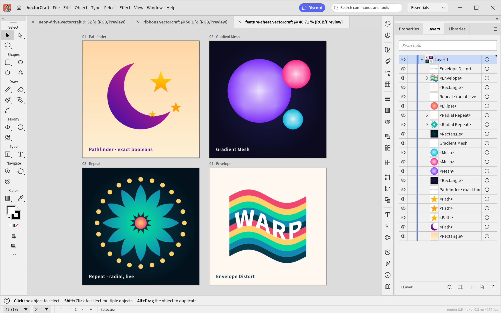
  
<b>Multiple artboards, light theme</b>: Pathfinder · Gradient Mesh · live radial Repeat · Envelope Distort · <code>examples/feature-sheet.vectorcraft</code>

</td>
</tr>
</table>

## Made in VectorCraft

Every piece below was built entirely through VectorCraft's command API, the same one the MCP server
exposes to agents, and exported by VectorCraft's own renderer.

<table>
<tr>
<td width="50%" valign="top">
  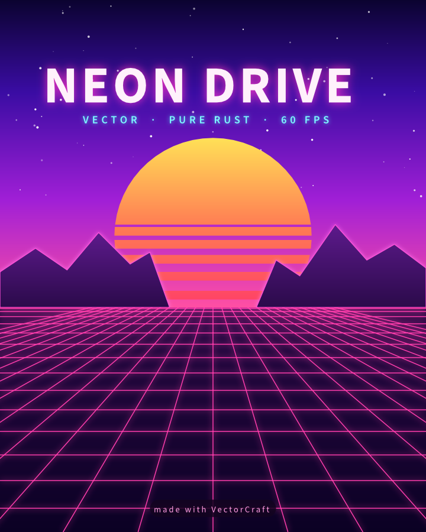
  
<b>Neon Drive</b>: synthwave poster with glowing type and grid

</td>
<td width="50%" valign="top">
  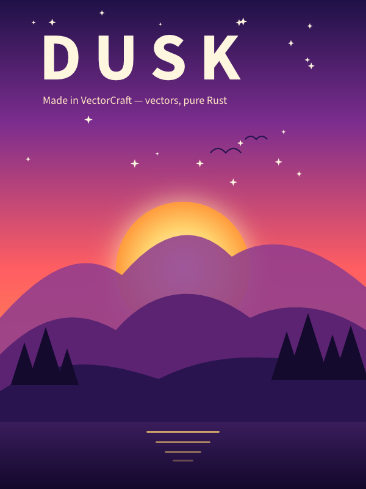
  
<b>Dusk</b>: gradient sky, glowing sun, layered mountains

</td>
</tr>
<tr>
<td colspan="2" valign="top">
  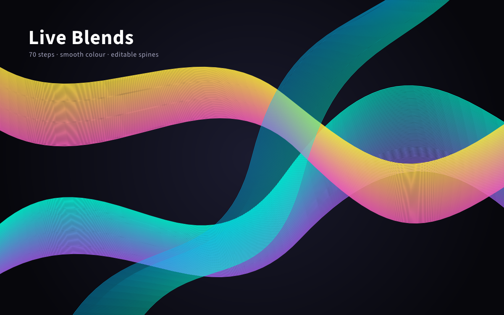
  
<b>Live Blends</b>: 70 steps, smooth colour, editable spines

</td>
</tr>
<tr>
<td width="50%" valign="top">
  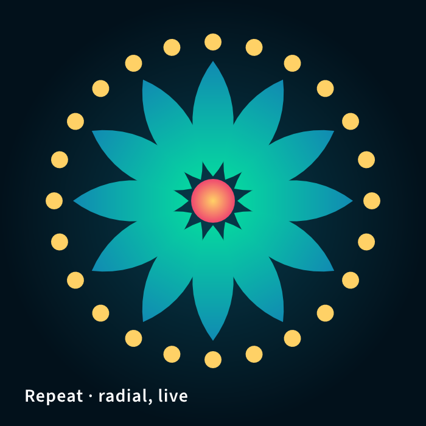
  
<b>Radial Repeat</b>: a live mandala

</td>
<td width="50%" valign="top">
  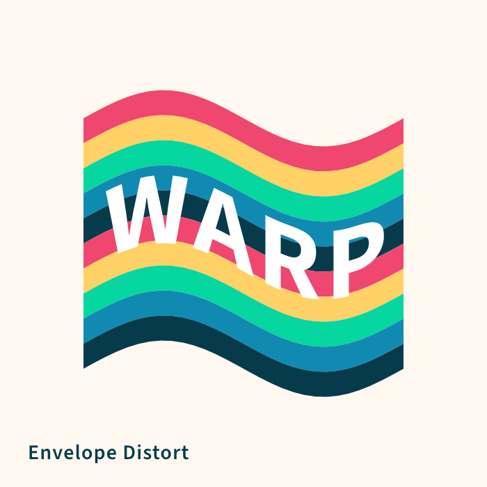
  
<b>Envelope Distort</b>: striped type warped into a flag

</td>
</tr>
<tr>
<td width="50%" valign="top">
  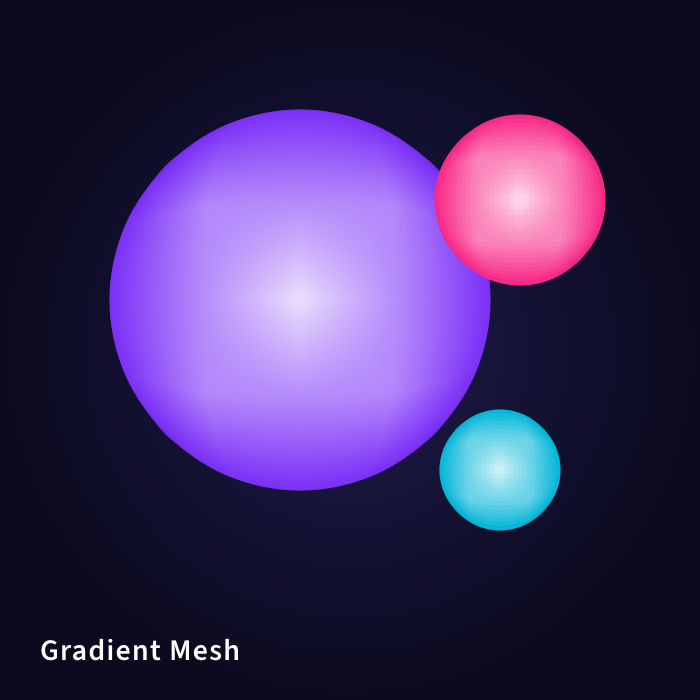
  
<b>Gradient Mesh</b>: shaded spheres

</td>
<td width="50%" valign="top">
  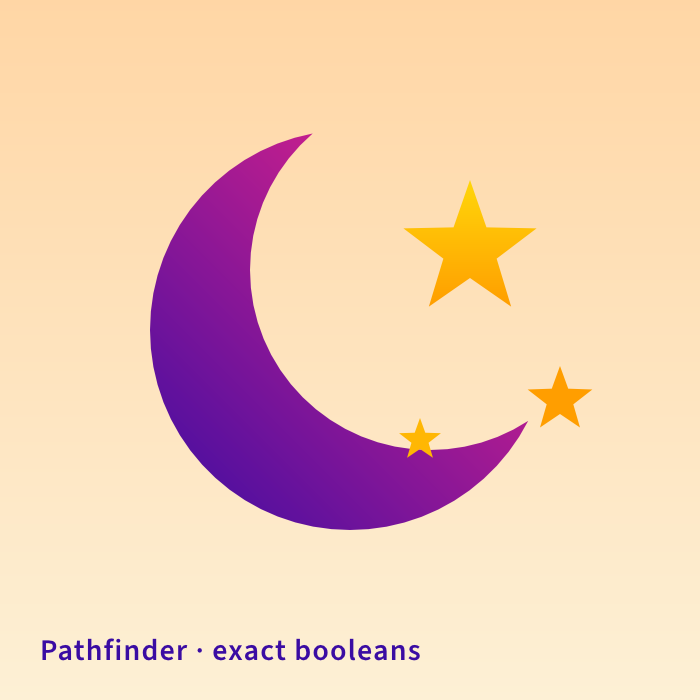
  
<b>Pathfinder</b>: a crescent and stars from exact booleans

</td>
</tr>
</table>

## Why VectorCraft

- **Familiar.** Illustrator's layout, tools, menus, panels and shortcuts: the Pen, Direct Selection,
  Pathfinder, Smart Guides, Appearance, Swatches, Layers and more. You already know how to use it.
- **Fast.** Multithreaded SIMD rendering off the UI thread. 20,000 shapes render in about 27 ms at
  full retina resolution while the interface stays at 120 fps.
- **Robust.** Exact curve booleans (no "cannot perform operation"), unlimited undo via structural
  sharing, and property-tested file round trips.
- **Open.** A documented native format (`.vectorcraft`, JSON), first-class SVG, PDF (and
  PDF-compatible `.ai`) import and export, PNG/JPEG/WebP export, Export for Screens, and SVGZ,
  templates, GIF, TIFF and BMP on open.
- **Agent-native.** Every menu item, tool gesture, panel and dialog can be driven over a JSON
  control channel and an **MCP server**, so Claude and other agents can draw, edit and export the
  way a person does.
- **Everywhere.** One codebase for the desktop apps and the same UI in the browser.

## Quick start

[View all releases](../../releases)

| Platform | Download | Run |
|----------|----------|-----|
| **Windows x64** | [vectorcraft-x64.7z](../../releases) | Run installer → launch `vectorcraft-x64.7z` |
| **Linux x64** | [vectorcraft-Linux-x64.run](../../releases) | `chmod +x` → run installer |
| **macOS Apple Silicon** | [vectorcraft-macOS-arm64.dmg](../../releases) | Open DMG → drag to Applications |

## Status

**Where we are (2026-10-07):** roughly 69–75% of Illustrator's features exist and work, and about 40–55% of
"a power user can't tell the difference". Everyday vector illustration is close to usable: drawing and path tools,
Pathfinder and Shape Builder, paint, gradients, appearance and transparency, type with styles, threading and Hebrew/Arabic bidirectional layout, and
files (SVG, PDF and PDF-compatible `.ai` with PDF/X, EPS, DXF, EMF/WMF, raster formats and PSD, Print, Package).
Affinity documents (`.af` from Affinity 3, `.afdesign`, `.afpub` and, by their content, `.afphoto` from Affinity 1 and 2) open
and place natively: layers, groups, artboards and pages, curves and shapes, fills, gradients and strokes, clipping
and masks, text and images, with what didn't come in (effects, adjustments, brushes, master pages…) listed in the
import warning; a file whose native data can't be read opens as its embedded preview, saying why. VectorCraft
doesn't write Affinity files.
The interface
speaks English, Japanese, Traditional and Simplified Chinese, Spanish, French, Italian and Russian (and Czech and Brazilian Portuguese in the menus).

**What's missing:**
- 3D and Materials;
- the Photoshop-style raster effects (Effect Gallery);
- CJK composition for vertical type (vertical type itself has initial support, with a Japanese interface);
- Variables and scripting;
- an interaction-fidelity pass covering every tool's modifiers and small behaviours;
- packaging for Windows and Linux.

**Where we're going:** next is the interaction-fidelity pass alongside the raster-effects package, then 3D and
advanced type, then hardening and packaging for 1.0.

## License and credits

VectorCraft is dual-licensed under [MIT](LICENSE-MIT) or [Apache-2.0](LICENSE-APACHE), at your option.
Copyright (c) 2026 ArtCraft Team and the VectorCraft contributors. Required notices are in [NOTICE](NOTICE).
